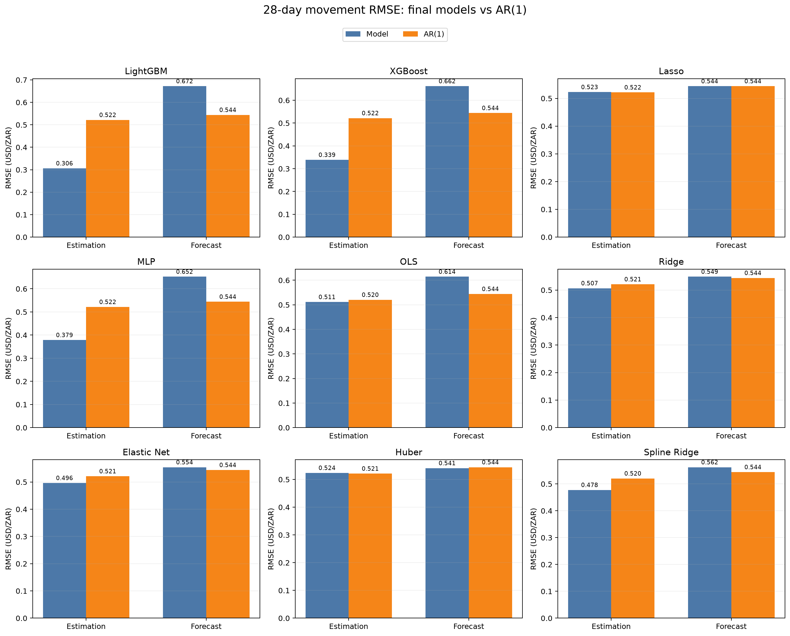
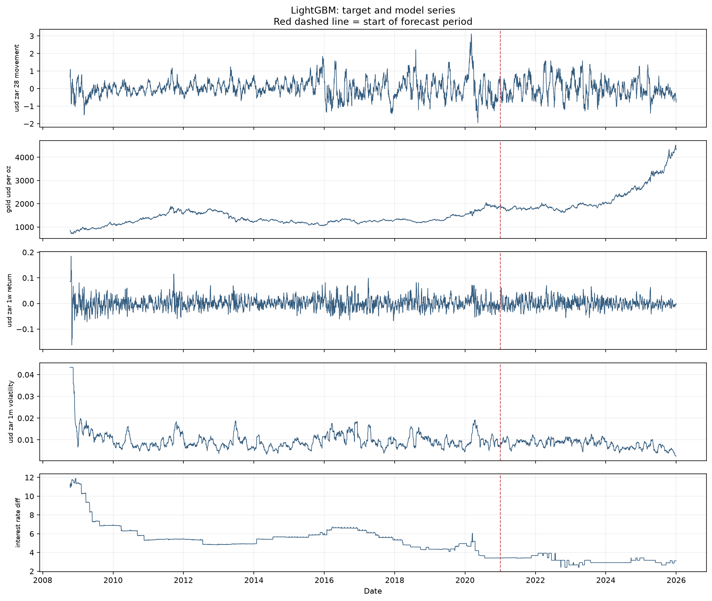
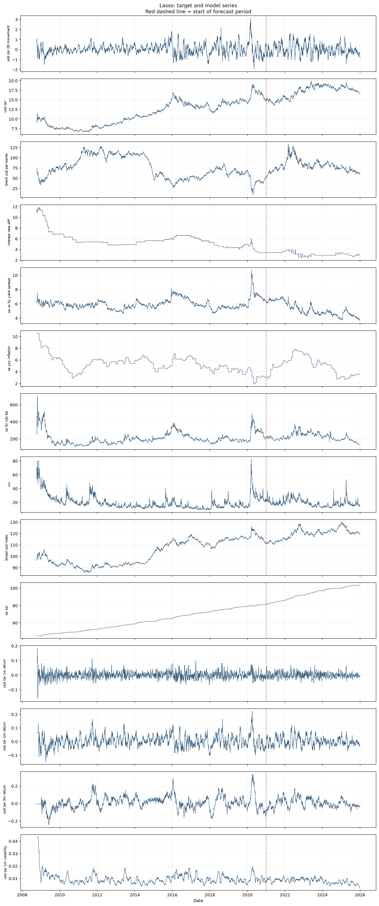
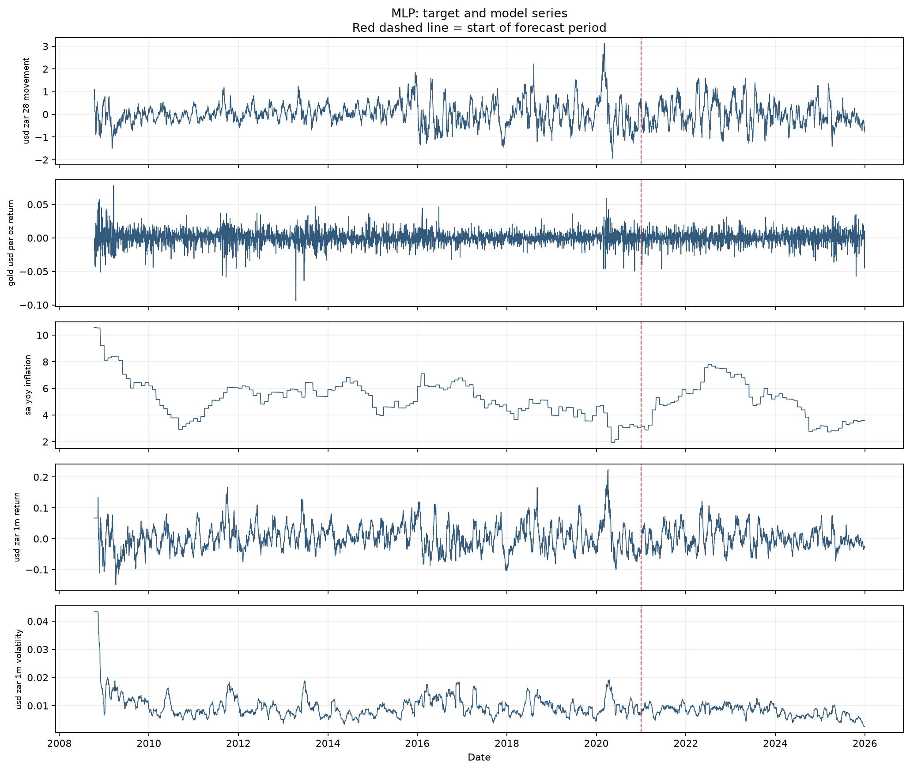
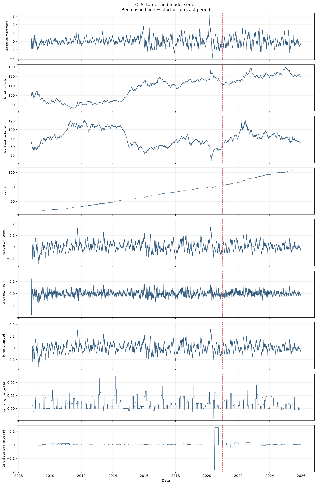
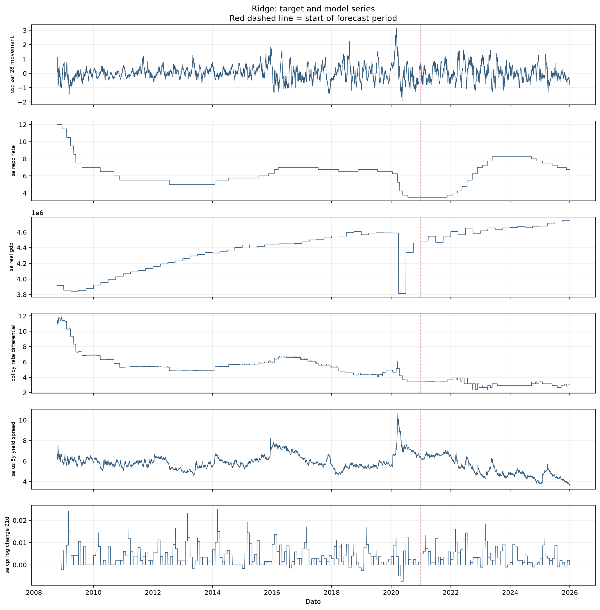
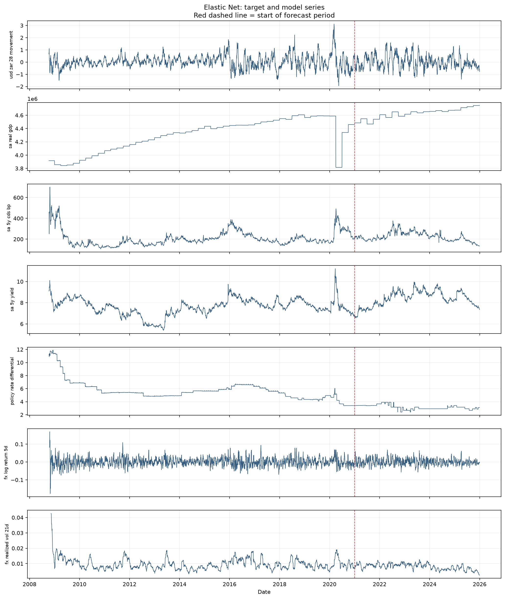
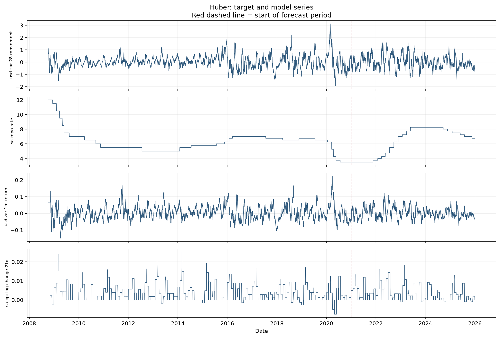
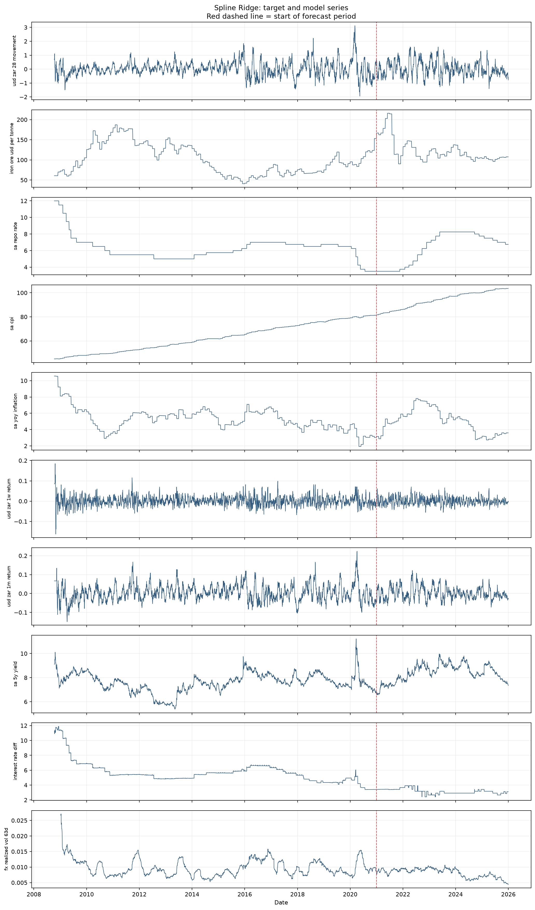

# Final model report

The target is the 28-observation-ahead USD/ZAR movement, `usd_zar_28 - usd_zar`. Every model is estimated only on the chronological training period; the 2021–2025 period is an untouched forecast evaluation. RMSE is in USD/ZAR units, and lower is better. AR(1) is fitted to log USD/ZAR on the estimation sample and iterated 28 steps.

## Sample summary

| Model | Estimation observations | Forecast observations | Estimation start | Estimation end | Forecast start | Forecast end | Predictors |
| --- | --- | --- | --- | --- | --- | --- | --- |
| LightGBM | 3190 | 1304 | 2008-10-10 | 2020-12-31 | 2021-01-01 | 2025-12-31 | 4 |
| XGBoost | 3190 | 1304 | 2008-10-10 | 2020-12-31 | 2021-01-01 | 2025-12-31 | 4 |
| Lasso | 3190 | 1304 | 2008-10-10 | 2020-12-31 | 2021-01-01 | 2025-12-31 | 13 |
| MLP | 3190 | 1304 | 2008-10-10 | 2020-12-31 | 2021-01-01 | 2025-12-31 | 4 |
| OLS | 3127 | 1304 | 2009-01-07 | 2020-12-31 | 2021-01-01 | 2025-12-31 | 8 |
| Ridge | 3169 | 1304 | 2008-11-10 | 2020-12-31 | 2021-01-01 | 2025-12-31 | 5 |
| Elastic Net | 3168 | 1304 | 2008-11-11 | 2020-12-31 | 2021-01-01 | 2025-12-31 | 6 |
| Huber | 3169 | 1304 | 2008-11-10 | 2020-12-31 | 2021-01-01 | 2025-12-31 | 3 |
| Spline Ridge | 3126 | 1304 | 2009-01-08 | 2020-12-31 | 2021-01-01 | 2025-12-31 | 9 |

## RMSE comparison

| Model | Period | AR(1) RMSE | Model RMSE |
| --- | --- | --- | --- |
| Elastic Net | Estimation | 0.5212 | 0.4964 |
| Elastic Net | Forecast | 0.5441 | 0.5543 |
| Huber | Estimation | 0.5211 | 0.5237 |
| Huber | Forecast | 0.5441 | 0.5409 |
| Lasso | Estimation | 0.5217 | 0.5228 |
| Lasso | Forecast | 0.5441 | 0.544 |
| LightGBM | Estimation | 0.5217 | 0.3062 |
| LightGBM | Forecast | 0.5441 | 0.6721 |
| MLP | Estimation | 0.5217 | 0.3785 |
| MLP | Forecast | 0.5441 | 0.6524 |
| OLS | Estimation | 0.5204 | 0.5114 |
| OLS | Forecast | 0.5441 | 0.6145 |
| Ridge | Estimation | 0.5211 | 0.5067 |
| Ridge | Forecast | 0.5441 | 0.5486 |
| Spline Ridge | Estimation | 0.5204 | 0.4777 |
| Spline Ridge | Forecast | 0.5441 | 0.5623 |
| XGBoost | Estimation | 0.5217 | 0.3387 |
| XGBoost | Forecast | 0.5441 | 0.6619 |

## Models and series

### LightGBM

Gradient-boosted decision trees that capture nonlinearities and interactions.

**Data used:** `gold_usd_per_oz`, `usd_zar_1w_return`, `usd_zar_1m_volatility`, `interest_rate_diff`.

### XGBoost

Regularised gradient-boosted trees, using shallow trees and row/column subsampling.

**Data used:** `gold_usd_per_oz`, `usd_zar_1w_return`, `usd_zar_1m_volatility`, `interest_rate_diff`.

### Lasso

Standardised linear regression with L1 shrinkage, which can set coefficients to zero.

**Data used:** `usd_zar`, `brent_usd_per_barrel`, `interest_rate_diff`, `sa_us_5y_yield_spread`, `sa_yoy_inflation`, `sa_5y_cds_bp`, `vix`, `broad_usd_index`, `sa_cpi`, `usd_zar_1w_return`, `usd_zar_1m_return`, `usd_zar_3m_return`, `usd_zar_1m_volatility`.

### MLP

A three-hidden-layer neural network for nonlinear predictor interactions.

**Data used:** `gold_usd_per_oz_return`, `sa_yoy_inflation`, `usd_zar_1m_return`, `usd_zar_1m_volatility`.

### OLS

Standardised ordinary least squares, imposing a linear additive relationship.

**Data used:** `broad_usd_index`, `brent_usd_per_barrel`, `sa_cpi`, `usd_zar_1m_return`, `fx_log_return_5d`, `fx_log_return_21d`, `sa_cpi_log_change_21d`, `sa_real_gdp_log_change_63d`.

### Ridge

Standardised linear regression with L2 shrinkage to stabilise correlated predictors.

**Data used:** `sa_repo_rate`, `sa_real_gdp`, `policy_rate_differential`, `sa_us_5y_yield_spread`, `sa_cpi_log_change_21d`.

### Elastic Net

Linear regression combining L1 feature selection and L2 coefficient shrinkage.

**Data used:** `sa_real_gdp`, `sa_5y_cds_bp`, `sa_5y_yield`, `policy_rate_differential`, `fx_log_return_5d`, `fx_realized_vol_21d`.

### Huber

Robust linear regression that reduces the influence of unusually large residuals.

**Data used:** `sa_repo_rate`, `usd_zar_1m_return`, `sa_cpi_log_change_21d`.

### Spline Ridge

Quadratic spline transformations followed by Ridge, allowing smooth nonlinear effects.

**Data used:** `iron_ore_usd_per_tonne`, `sa_repo_rate`, `sa_cpi`, `sa_yoy_inflation`, `usd_zar_1w_return`, `usd_zar_1m_return`, `sa_5y_yield`, `interest_rate_diff`, `fx_realized_vol_63d`.

